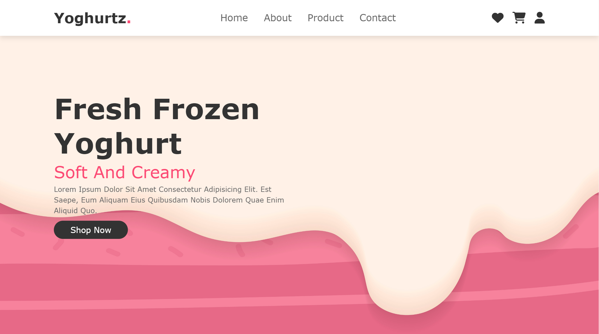
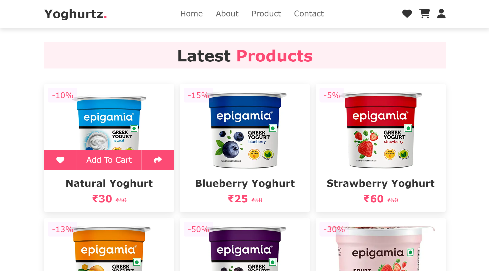
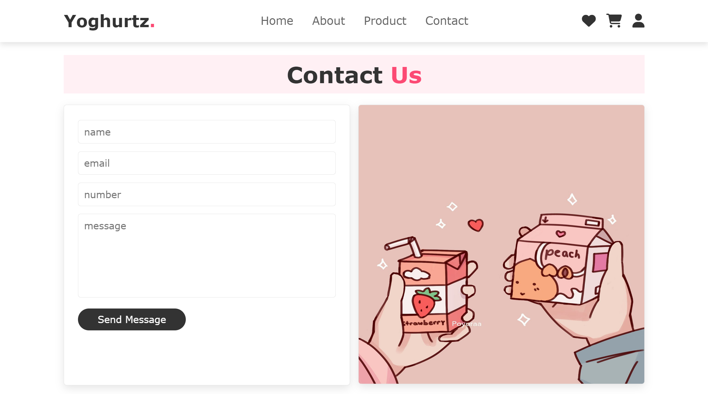

# Yoghurtz - Online Yogurt Shop

Yoghurtz is an online yogurt shop frontend template designed to showcase products, provide information about the shop, and offer a contact form for inquiries.
Visit the live website - [Yoghurtz](https://yoghurtz.vercel.app/) 

## Preview

## Features

- **Product Showcase:** Display your yogurt products with images and descriptions.
- **About Us Section:** Inform visitors about your shop's story, values, and mission.
- **Contact Form:** Allow customers to reach out with questions or feedback.
- **Responsive Design:** Ensure a seamless experience across various devices and screen sizes.

## Technologies Used

- HTML5: Structure the content of the webpage.
- CSS3: Style the layout, colors, and typography.
- JavaScript: Enhance interactivity and dynamic content.

## Usage

1. Clone the repository: `git clone https://github.com/YourUsername/Yoghurtz.git`
2. Open the `index.html` file in your web browser or host it on a web server.

## Contributing

Contributions are welcome! Please feel free to submit issues or pull requests if you have any suggestions, bug fixes, or enhancements.

## License

This project is licensed under the MIT License - see the [LICENSE](LICENSE.txt) file for details.
